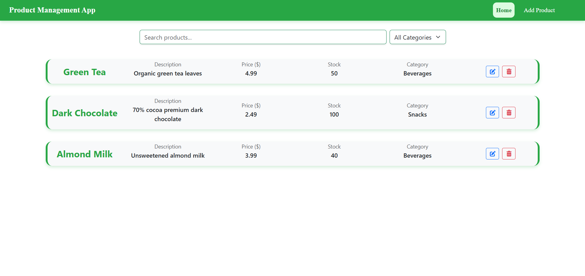
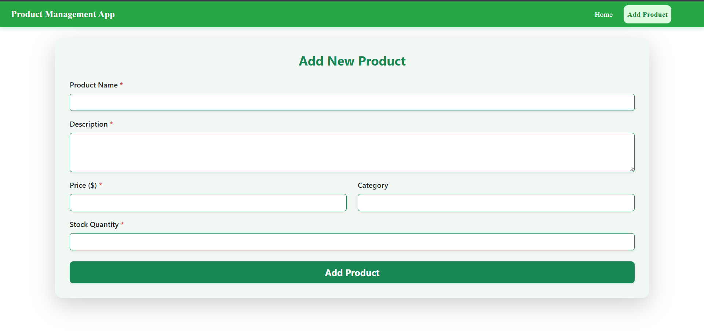
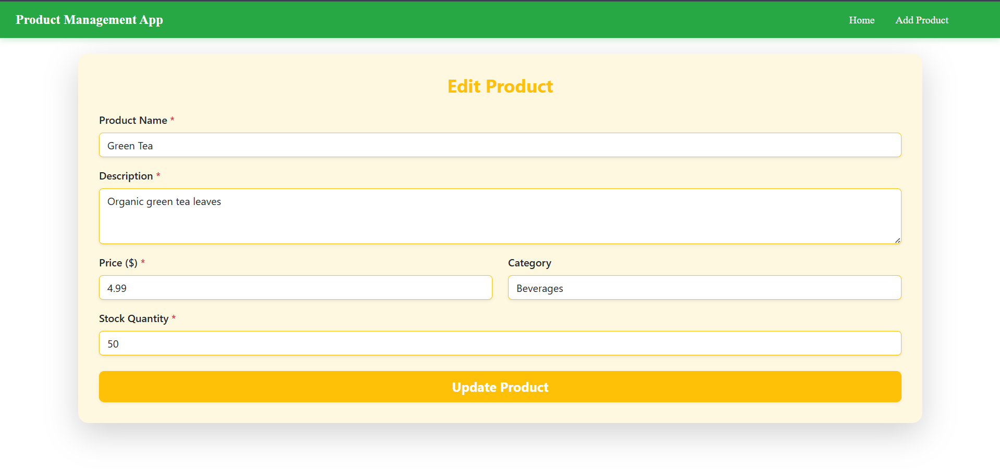
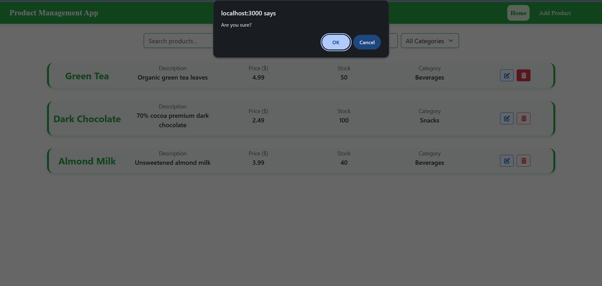

# Product Management App

A full-stack product management system built with **React** for the frontend and a REST API backend. The app allows users to **view, search, filter, add, edit, and delete products** in a clean and responsive interface.

## Table of Contents

* [Features](#features)
* [Tech Stack](#tech-stack)
* [Installation](#installation)
* [Usage](#usage)
* [API Endpoints](#api-endpoints)
* [Project Structure](#project-structure)
* [Screenshots](#screenshots)
* [Contributing](#contributing)
* [License](#license)

---

## Features

* **Product CRUD:** Create, read, update, and delete products.
* **Search & Filter:** Search products by name, description, or category. Filter products by category.
* **Responsive Design:** Works well on mobile and desktop screens.
* **Category Management:** Products grouped by category for easy browsing.
* **Validation:** Form validation for required fields.
* **Navigation:** Separate pages for home, add product, and edit product.

---

## Tech Stack

* **Frontend:** React.js, Bootstrap 5, React Router DOM
* **Backend:** REST API (Node.js/Express or your preferred backend)
* **Database:** MySQL / SQLite / PostgreSQL
* **HTTP Client:** Axios

---

## Installation

1. Clone the repository:

```bash
git clone https://github.com/yourusername/product-management-app.git
```

2. Navigate to the frontend folder and install dependencies:

```bash
cd frontend
npm install
```

3. Start the React development server:

```bash
npm start
```

4. Ensure your backend API is running and accessible at the correct base URL. Update `api.js` if necessary.

---

## Usage

* **Home Page:**
  Displays the product list with search and category filter. Edit or delete products using the action buttons.

* **Add Product Page:**
  Fill in product details and submit to add a new product.

* **Edit Product Page:**
  Navigate from the home page by clicking the edit button. Update product details and submit.

---

## API Endpoints

| Method | Endpoint        | Description                |
| ------ | --------------- | -------------------------- |
| GET    | `/products`     | Get all products           |
| GET    | `/products/:id` | Get a single product       |
| POST   | `/products`     | Add a new product          |
| PUT    | `/products/:id` | Update an existing product |
| DELETE | `/products/:id` | Delete a product           |

---

## Project Structure

```
product-management-app/
│
├── frontend/
│ ├── src/
│ │ ├── components/
│ │ │ ├── AddProductForm.js
│ │ │ ├── EditProductForm.js
│ │ │ ├── ProductList.js
│ │ │ ├── Nav.js # Navigation bar component
│ │ ├──api.js
│ │ ├── App.js # Main app component with routes
│ │ ├── App.css # Custom styles
│ │ └── index.js # Entry point
│ └── package.json
│
├── backend/
│ ├── config/
│ │ └── db.js # Database connection
│ ├── controllers/
│ │ └── productController.js # Handles CRUD operations
│ ├── models/
│ │ └── Product.js # Product model
│ ├── routes/
│ │ └── api.js # API endpoints
│ └── index.js # Backend entry point
│
└── README.md
```

---

## Screenshots

**Home Page with Search & Filter**


**Add Product Form**


**Edit Product Form**


**Delete Product Form**

---

## Contributing

1. Fork the repository.
2. Create a new branch: `git checkout -b feature/your-feature`.
3. Commit your changes: `git commit -m 'Add some feature'`.
4. Push to the branch: `git push origin feature/your-feature`.
5. Open a Pull Request.

---

## License

This project is licensed under the **MIT License**.

---

**Author:** Gokul D
**Portfolio / GitHub:** [https://github.com/GOKULDEV0](https://github.com/GOKULDEV0)
